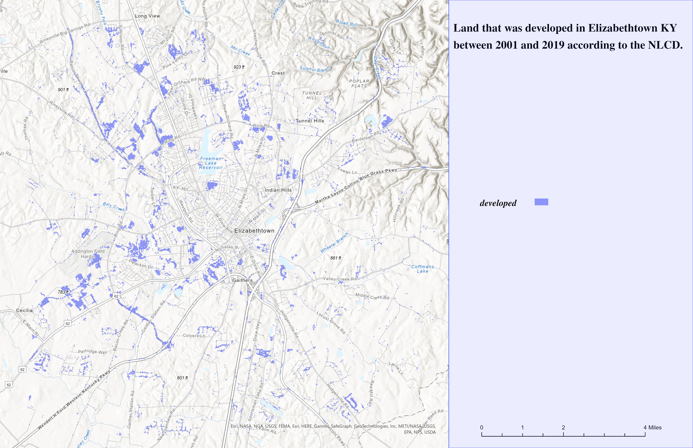

# Land Development in Elizabethtown KY from 2001-2019

## Land across the US has been seeing a large amount of sprawl, Elizabethtown is no different.

In the years since 2001, nearly 2500 acres of land was developed in Elizabethtown and the surrounding area. 

     
*According the the NLCD: map by Reisz Krampe*

[Link to downloadable georefferenced pdf](Lab-06.pdf)
